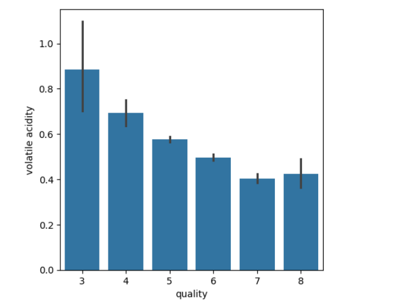
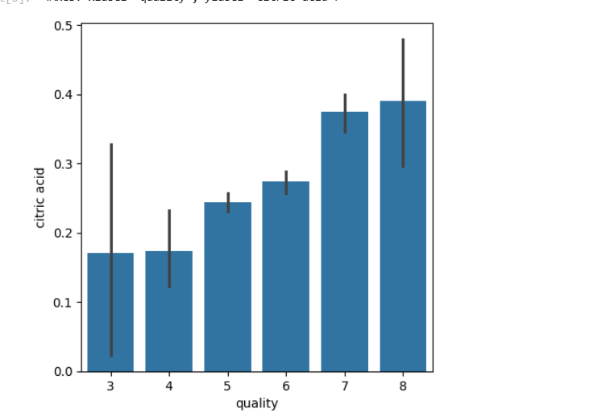
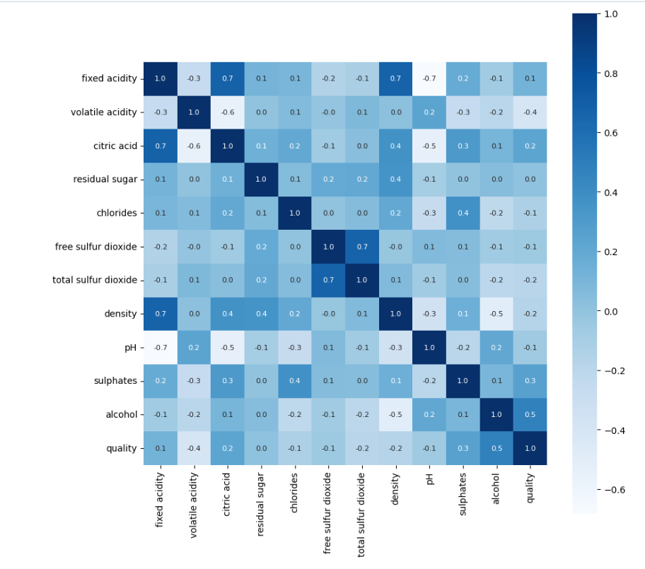

🍷 **Wine Quality Classification**

📌 Overview

This project uses machine learning to classify wine quality based on its physicochemical properties. The dataset used is the Red Wine Quality dataset, and a **Random Forest Classifier**is employed for classification.

📊 **Dataset**

The dataset contains 1,599 samples of red wine, with 11 numerical features representing physicochemical attributes:

🍇 Fixed acidity            🛡️ Free sulfur dioxide  

🍷 Volatile acidity          🛡️ Total sulfur dioxide

🍊 Citric acid                🌊 Density

🍬 Residual sugar            ⚗️ pH

🧂 Chlorides                  🌿 Sulphates

**The target variable, quality, is transformed into a binary classification**

✅ 1 (Good Quality) if quality >= 7

❌ 0 (Bad Quality) otherwise

**Graphs & Maps Created:**

📉 Bar Plot: volatile acidity vs. quality

📈 Bar Plot: citric acid vs. quality

🌡️ Heatmap: Correlation between all features using seaborn.heatmap

**Results**

✅ The Random Forest model achieves an accuracy of 93.44% on the test dataset.
